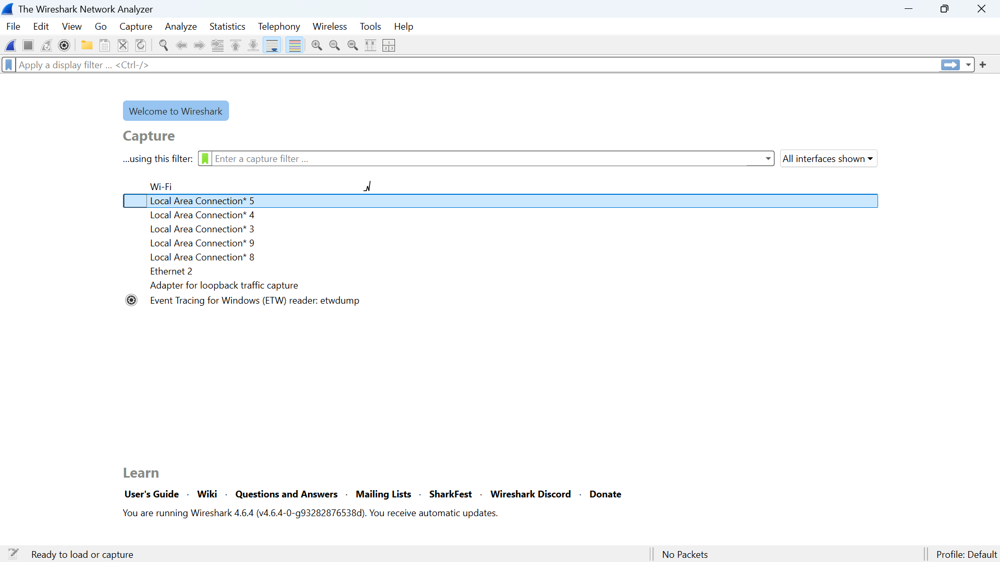
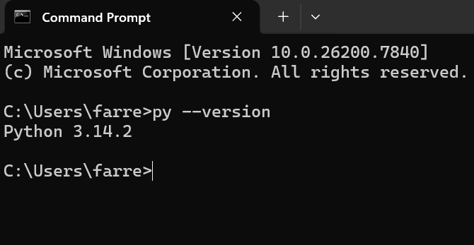

# Laporan Praktikum Jaringan Komputer 
## Modul 1 

* **Nama:** Farrellino Ulung Satya Amando
* **NIM:** 103072400005
* **Kelas:** IF 04-01 

---

### 1. Tujuan Praktikum
Mempersiapkan tools yang akan digunakan

### 2. Instalasi Wireshark
* Instal wireshark dari website resminya, yaitu [http://www.wireshark.org/](http://www.wireshark.org/)
* Setelah Instalasi, buka wireshark:
  

### 3. Instalasi Python
* Install python dari [https://www.python.org/downloads/](https://www.python.org/downloads/)
* Buka Command Prompt dan ketik py --version untuk melakukan pengecekan versi python yang sekaligus menandakan python telah terinstal
* 
