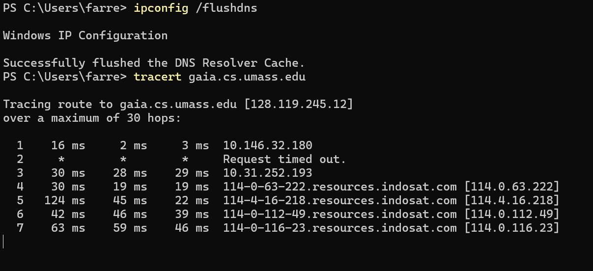
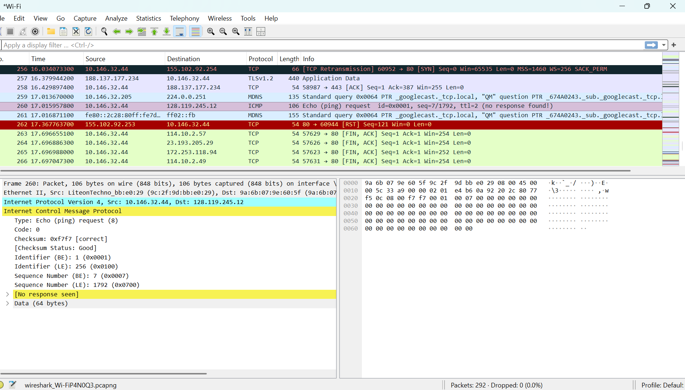
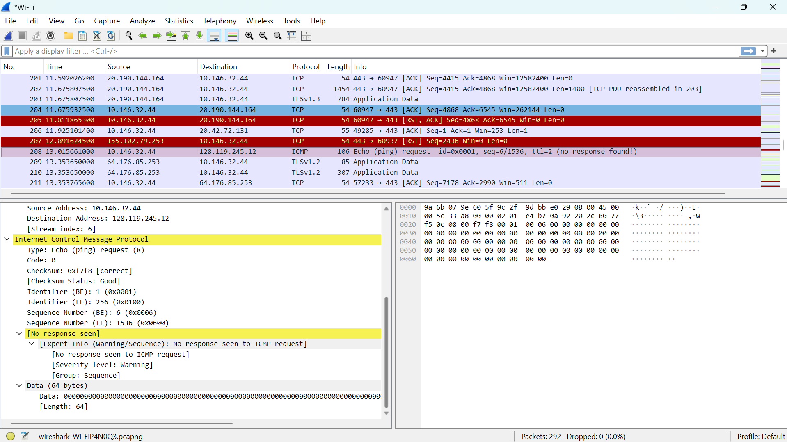

# Laporan Praktikum Jaringan Komputer | Modul 10

**Nama:** Farrellino Ulung Satya Amando  
**NIM:** 103072400005  
**Kelas:** IF 04-01     
---

## 1. Analisis IPv4 Dasar
Langkah-langkahnya adalah:
  1. Buka Wireshark dan aktifkan proses penangkapan paket pada interface Wi-Fi.
  2. Eksekusi perintah `tracert gaia.cs.umass.edu` pada terminal command prompt.
  3. Hentikan capture lalu terapkan filter logis `ip.src == 192.168.100.31 && ip.dst == 128.119.245.12`.

> **

**Analisis:**
Dari hasil tangkapan paket di Wireshark, dapat terlihat jajaran paket ICMP yang menandakan aktivitas penelusuran rute oleh perintah traceroute menuju server target. Aliran lalu lintas data ini didominasi oleh pengiriman paket ICMP Echo Request secara berkala dari host lokal ke alamat tujuan, yang kemudian dibalas dengan paket ICMP berisi pesan kesalahan dari deretan alamat IP router perantara (*intermediate routers*) yang berhasil dilewati sepanjang jalur transmisi.

## 2. Detail Header ICMP Destination Unreachable
Langkah-langkahnya adalah:
  1. Telusuri daftar paket data hasil capture di Wireshark.
  2. Temukan paket respon ICMP yang berstatus *destination unreachable*.
  3. Amati susunan parameter Type serta Code pada detail enkapsulasi objek pesan.

> **

**Analisis:**
Paket laporan kesalahan jaringan berupa ICMP Type 3 (Destination Unreachable) dengan Code 3 (Port Unreachable) berhasil diakses dan dianalisis. Kejadian ini timbul karena mekanisme pelacakan rute pada sistem operasi Windows memanfaatkan pengiriman pesan data menggunakan protokol transport UDP menuju nomor port tujuan tinggi acak yang sengaja tidak diaktifkan di sisi host target. Ketika paket sampai di hop terakhir, router lokal penanggung jawab mengirim balik paket error ini untuk memberi tahu host asal bahwa port tersebut tidak dapat diakses.

## 3. Analisis ICMP Echo Request (Ping)
Langkah-langkahnya adalah:
  1. Pilih salah satu frame kueri ICMP Echo Request pada jendela utama Wireshark.
  2. Lakukan ekspansi rincian informasi pada bagian lapisan Internet Protocol Version 4.
  3. Amati kapasitas ukuran total paket beserta penomoran identifikasinya.

> **

**Analisis:**
Pemeriksaan pada struktur header IPv4 kueri permintaan (Echo Request) memperlihatkan nilai *Header Length* standar sebesar 20 bytes dengan kapasitas ukuran panjang total (*Total Length*) mencapai 92 bytes. Kolom identifikasi protokol bernilai 1, yang menegaskan bahwa payload di layer atasnya dibungkus oleh protokol ICMP. Konfigurasi ini juga memuat keabsahan informasi pengalamatan IP asal yang bersumber langsung dari host praktikan (192.168.100.31) menuju IP destinasi luar (128.119.245.12).

## 4. Analisis ICMP Time-to-Live Exceeded
Langkah-langkahnya adalah:
  1. Cari frame balasan berstatus kesalahan batas waktu dari router intermedier di Wireshark.
  2. Periksa detail parameter struktur internal dari protokol ICMP tersebut.
  3. Amati data salinan datagram asli yang dilampirkan pada muatannya.

> **

**Analisis:**
Tangkapan paket di atas memverifikasi kedatangan pesan diagnostik ICMP Type 11 dengan Code 0 yang mengonfirmasi bahwa batas waktu paket telah habis dalam perjalanan (*Time-to-live exceeded in transit*). Hal ini terjadi karena router perantara mendeteksi nilai TTL pada paket asli yang diterimanya telah berkurang hingga menyentuh angka 0, sehingga paket tersebut dibuang demi mencegah *routing loop*. Router kemudian menyelipkan kembali potongan informasi header IP asli di dalam payload paket kesalahan ini sebagai acuan pelacakan bagi sisi pengirim.

## 5. Analisis Mekanisme TTL pada Traceroute
Langkah-langkahnya adalah:
  1. Amati deretan paket kueri ICMP secara berurutan dari atas ke bawah pada Wireshark.
  2. Bandingkan nilai kolom parameter TTL dari satu paket kueri ke paket kueri berikutnya.
  3. Amati korelasi antara pertambahan nilai TTL terhadap daftar hop router yang merespon.

**Analisis:**
Cara kerja penemuan jalur oleh perintah traceroute terbukti mengandalkan skema manipulasi nilai field TTL secara bertahap dan menaik (dimulai dari TTL=3, kemudian naik ke TTL=4, TTL=5, dan seterusnya). Strategi ini sengaja memicu batas kedaluwarsa pada setiap tingkatan router perantara secara beruntun. Dengan mengumpulkan informasi alamat IP asal dari setiap paket kesalahan TTL yang datang kembali ke sistem, komputer praktikan dapat memetakan topologi urutan router pengantar secara kronologis hingga mencapai server tujuan akhir.

## 6. Penyaringan Paket ICMP di Wireshark
Langkah-langkahnya adalah:
  1. Arahkan kursor menuju baris pengisian ekspresi filter di bagian atas antarmuka Wireshark.
  2. Masukkan sintaks filter logis spesifik `icmp && ip.dst == 192.168.100.31`.
  3. Evaluasi hasil penyaringan paket data kendali yang tersaji.

**Analisis:**
Penerapan filter pencarian terfokus terbukti mempermudah proses isolasi paket di tengah padatnya arus data pada lalu lintas kartu jaringan. Melalui parameter penyaringan ini, Wireshark memotong tampilan data untuk hanya menyajikan runtunan paket kendali ICMP yang masuk menuju komputer praktikan. Langkah pemisahan ini sangat efektif dalam memantau selisih waktu respons serta mencocokkan kode urutan kueri antara paket *request* yang dikirim dengan paket *error response* yang diterima kembali.

## 7. Analisis Fragmentasi IP
Langkah-langkahnya adalah:
  1. Periksa rincian bit indikator pada field *Flags* di dalam header IPv4.
  2. Amati parameter penanda jarak pergeseran muatan (*Fragment Offset*).
  3. Bandingkan ukuran total panjang paket dengan ambang batas transmisi media lokal.

**Analisis:**
Pada skenario pengujian praktikum ini, gejala fragmentasi paket terpantau tidak terjadi. Kondisi tersebut dikarenakan ukuran total dari paket data kueri yang dikirimkan hanya sebesar 92 bytes, yang nilainya jauh di bawah ambang batas standar *Maximum Transmission Unit* (MTU) media Ethernet sebesar 1500 bytes. Bukti ini diperkuat oleh parameter *Flags* di mana bit *More Fragments* (MF) bernilai 0 dan *Fragment Offset* bernilai 0, menandakan data terangkut utuh dalam satu datagram tunggal tanpa perlu dipecah menjadi beberapa fragmen.

## 8. Overview Implementasi IPv6
Langkah-langkahnya adalah:
  1. Periksa bagian penanda versi protokol internet pada baris pertama komponen header IP.
  2. Tinjau skema pengalamatan alamat IP yang tercatat pada pengujian aktif.
  3. Analisis perbandingan teoretis arsitektur tipe IPv4 dengan tipe IPv6.

**Analisis:**
Hasil penangkapan paket memperlihatkan bahwa seluruh komunikasi data operasional dalam praktikum ini masih berjalan sepenuhnya di atas arsitektur IPv4. Faktor utama penyebabnya adalah infrastruktur jaringan lokal serta router perantara yang dilewati belum mengaktifkan fitur *dual-stack* IPv6, ditambah server target yang dihubungi masih meresolusi alamat IP lewat rekaman DNS tipe A. Secara teoretis, paket IPv6 akan memiliki panjang header tetap sebesar 40 bytes dengan ukuran alamat 128-bit, serta tidak mengizinkan adanya pemecahan fragmen data di tingkat router perantara demi efisiensi perutean rute global.

### 9. Kesimpulan
Berdasarkan praktikum Modul 10, dapat dipelajari hal-hal sebagai berikut.

1. Protokol IP bertindak sebagai fondasi utama pengalamatan paket data pada layer jaringan dengan memuat parameter kendali krusial seperti alamat asal, alamat tujuan, nomor protokol lapisan atas, serta batas waktu edar paket.
2. Mekanisme pelacakan rute oleh perintah traceroute dijalankan dengan memanfaatkan manipulasi penambahan nilai field *Time to Live* (TTL) secara bertahap demi memicu umpan balik paket error dari setiap router perantara sepanjang jalur.
3. Protokol kendali ICMP bekerja mendampingi operasi protokol IP dengan memfasilitasi fungsi pelaporan kondisi diagnostik galat pada jaringan, contohnya Type 8 (Echo Request), Type 11 (TTL Exceeded), dan Type 3 (Destination Unreachable).
4. Fenomena fragmentasi datagram IP merupakan proses pembagian muatan data yang akan otomatis dieksekusi oleh sistem apabila total ukuran panjang paket melebihi batas tampung MTU dari media fisik jaringan.
5. Pemanfaatan perangkat lunak packet sniffer seperti Wireshark sangat membantu visualisasi analisis parameter teoretis arsitektur susunan protokol internet secara langsung dan akurat.
