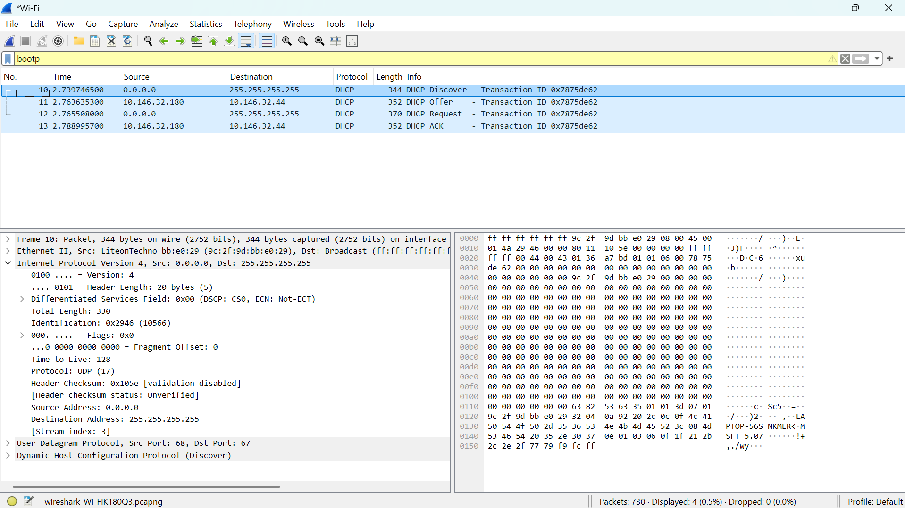
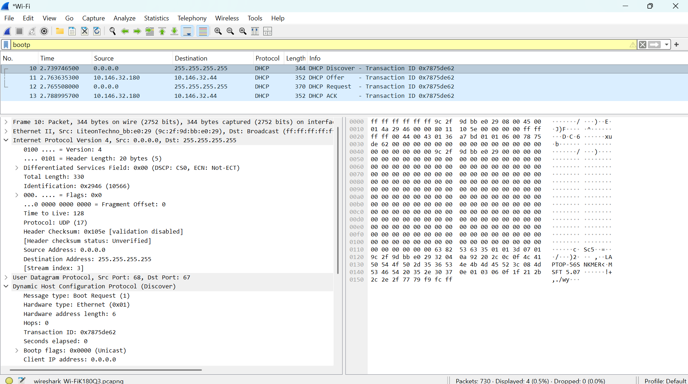
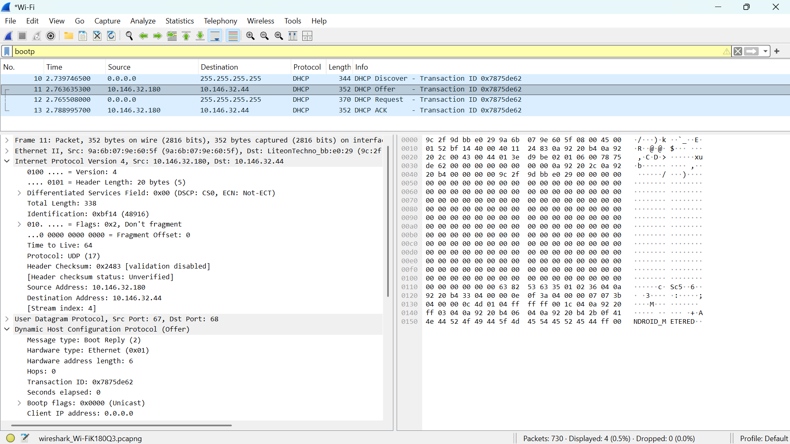
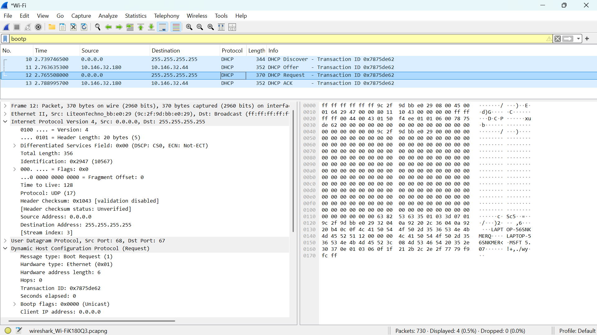
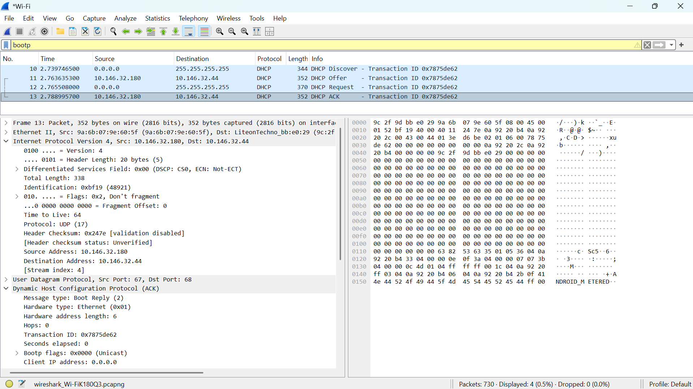

# Laporan Praktikum Jaringan Komputer | Modul 11

**Nama:** Farrellino Ulung Satya Amando  
**NIM:** 103072400005  
**Kelas:** IF 04-01     
---

## 1. Ikhtisar Penangkapan Paket DHCP
Langkah-langkahnya adalah:
  1. Buka *command prompt* dan jalankan perintah `ipconfig /release` untuk melepaskan alamat IP saat ini.
  2. Mulai penangkapan paket menggunakan Wireshark pada antarmuka Wi-Fi.
  3. Jalankan perintah `ipconfig /renew` untuk meminta pembaruan konfigurasi IP.
  4. Hentikan penangkapan setelah IP berhasil dialokasikan, lalu terapkan filter pencarian dengan kata kunci `bootp`.

> **

**Analisis:**
Dari hasil keseluruhan tangkapan, proses pembentukan alokasi IP awal terbukti berjalan melalui empat fase berurutan yang dikenal sebagai DORA (*Discover, Offer, Request, ACK*). Keempat frame transmisi awal ini terikat kuat dalam satu sesi komunikasi yang terstruktur, yang dibuktikan dengan adanya kesamaan identitas *Transaction ID* (0x12b91479). Di akhir proses tangkapan, terlihat juga sepasang paket terpisah (Request dan ACK) yang memiliki nilai *Transaction ID* berbeda, menandakan terjadinya sesi baru untuk proses perpanjangan masa sewa (*renewal*).

## 2. Analisis Paket DHCP Discover
Langkah-langkahnya adalah:
  1. Pilih dan sorot paket kueri pertama (Frame 83) yang berlabel DHCP Discover.
  2. Ekspansi rincian protokol aplikasi *Dynamic Host Configuration Protocol* di jendela detail paket.
  3. Amati struktur alamat sumber, alamat tujuan transmisi, dan *list* parameter yang diminta.

> **

**Analisis:**
Fase pertama dalam proses otomatisasi konfigurasi jaringan adalah pengiriman paket DHCP Discover. Karena klien pada tahap ini belum memiliki pengalamatan IP mandiri, field alamat IP sumber diisi secara *default* dengan 0.0.0.0. Paket kemudian dikirimkan menyebar secara *broadcast* ke alamat target universal 255.255.255.255 agar dapat didengar oleh seluruh entitas peladen DHCP di area jaringan lokal. Di dalam *payload*, klien menyematkan *Parameter Request List* yang berisi konfigurasi mutlak yang dibutuhkannya untuk berselancar, seperti Subnet Mask, Default Gateway (Router), dan pengalamatan DNS.

## 3. Analisis Paket DHCP Offer
Langkah-langkahnya adalah:
  1. Beralih ke paket balasan kedua (Frame 146) yang merespons pesan kueri pencarian.
  2. Periksa detail penawaran spesifikasi IP yang dirumuskan oleh server.

> **

**Analisis:**
Merespons permintaan *broadcast* dari klien, sebuah router (192.168.100.1) membalas dengan membawa paket penawaran atau DHCP Offer. Pada transmisi penawaran ini, server menyisihkan dan meminjamkan alamat IP spesifik 192.168.100.31 untuk calon klien tersebut. Bagian *Options* juga mendistribusikan konfigurasi pendukung jaringan seperti *Subnet Mask* bernilai /24 (255.255.255.0) dan alamat peladen DNS resolusi. Terlihat juga adanya informasi penawaran masa sewa sementara (*IP Address Lease Time*) yang ditetapkan amat singkat, yaitu hanya 60 detik.

## 4. Analisis Paket DHCP Request
Langkah-langkahnya adalah:
  1. Telusuri tangkapan ketiga (Frame 147) yang diluncurkan oleh antarmuka lokal.
  2. Amati bentuk persetujuan klien terhadap penawaran satu spesifik server.

> **

**Analisis:**
Walaupun klien telah menemukan kecocokan spesifikasi, pengiriman pesan persetujuan DHCP Request nyatanya tetap dieksekusi menggunakan mode *broadcast* tanpa koneksi langsung. Tindakan transmisi *broadcast* di fase Request ini diimplementasikan untuk memberikan konfirmasi formal terkait persetujuan alamat IP 192.168.100.31 ke server penawar (192.168.100.1), sekaligus mengumumkan secara publik kepada peladen DHCP lainnya di *network* (jika ada) bahwa tawaran mereka yang tertunda secara otomatis ditolak sehingga mereka bisa menarik kembali IP cadangannya.

## 5. Analisis Paket DHCP ACK
Langkah-langkahnya adalah:
  1. Buka kelengkapan rincian paket terakhir pada rentetan proses awal (Frame 148).
  2. Amati keputusan persetujuan akhir serta perpanjangan sewa durasi alamat IP.

> **

**Analisis:**
Tahapan interaksi DORA secara resmi dikunci tatkala server menembakkan instruksi *Acknowledgment* (ACK). Langkah verifikasi final ini memastikan klien telah diregistrasi sepenuhnya dan sah untuk segera mengoperasikan antarmukanya dengan pengalamatan 192.168.100.31. Terdapat modifikasi menarik pada parameter alokasi akhir, di mana masa peminjaman alamat (*Lease Time*) yang awalnya tercatat hanya 1 menit pada saat *Offer*, kini direvisi dan difinalisasi menjadi durasi panjang selama 3 hari penuh (259.200 detik).

## 6. Analisis DHCP Renewal (Pembaruan)
Langkah-langkahnya adalah:
  1. Analisis pola pengiriman data untuk dua frame kelanjutan tangkapan lalu lintas (Frame 401 dan 403).
  2. Bandingkan pergeseran metode pola alirannya (*source* dan *destination*) terhadap ritme transmisi DORA terdahulu.

**Analisis:**
Berlawanan dengan urutan inisialisasi DORA yang bergantung penuh pada metode interaksi penyebaran masif (*broadcast*), mekanisme perpanjangan masa pinjam konfigurasi IP berjalan melalui skema *unicast*. Dikarenakan antarmuka klien sudah teregistrasi dengan alamat jaringan utuh, pengajuan Request kali ini ditembakkan secara *point-to-point* spesifik ke alamat IP peladen pengelola. Rangkaian ini memotong alur birokrasi penemuan server, yang dibuktikan dengan total waktu tempuh interaksi (*Request-ACK*) yang terpangkas menjadi luar biasa efisien di kisaran ~0,06 detik.

### 7. Kesimpulan
Berdasarkan praktikum Modul 11, dapat dipelajari hal-hal sebagai berikut.

1. Implementasi sistem automasi pengalamatan DHCP digerakkan melalui empat deret fase pertukaran data sekuensial yang dikenal sebagai siklus DORA (*Discover*, *Offer*, *Request*, dan *ACK*).
2. Setiap siklus kesatuan transmisi untuk sebuah klien diikat dan divalidasi oleh nomor bit *Transaction ID* yang digenerasikan secara acak, guna menghindari tumbukan respon jika ada instalasi interaksi dari komputer (*host*) lain secara bersamaan.
3. Klien anonim yang mencari alokasi baru harus mendistribusikan lalu lintas secara terpaksa lewat mekanisme sebaran *broadcast* universal (tujuan ke IP 255.255.255.255), karena titik akses komunikasi lapis jaringan belum terbentuk sama sekali.
4. Perbedaan arsitektur mendasar tercatat dalam tahapan *renewal*, di mana pemeliharaan sistem IP yang kedaluwarsa memanfaatkan rute langsung atau interaksi *unicast*, sehingga efisiensi eksekusi melonjak drastis.
5. Tanggung jawab manajemen protokol DHCP tidak sempit hanya pada penyewaan IP secara angka, melainkan mengotomasikan pula segala elemen penyangga seperti konfigurasi *Gateway* untuk merutekan akses ke luar jaringan, penyiapan peladen *Domain Name System*, hingga besaran *Subnet Mask*.
