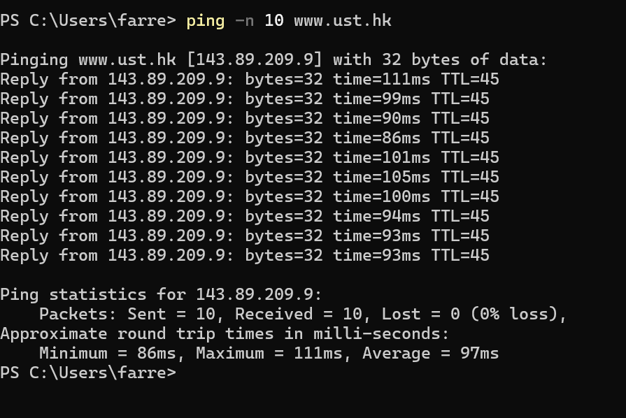
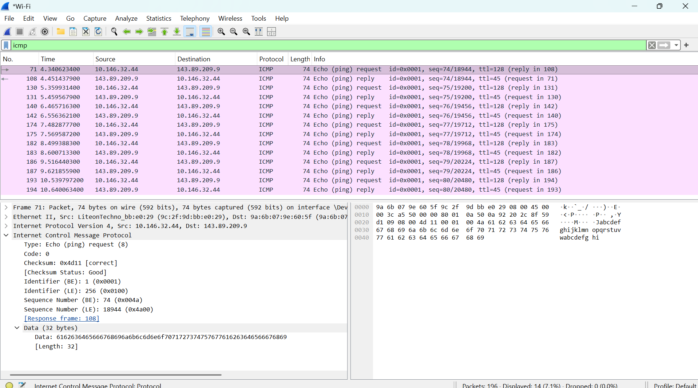
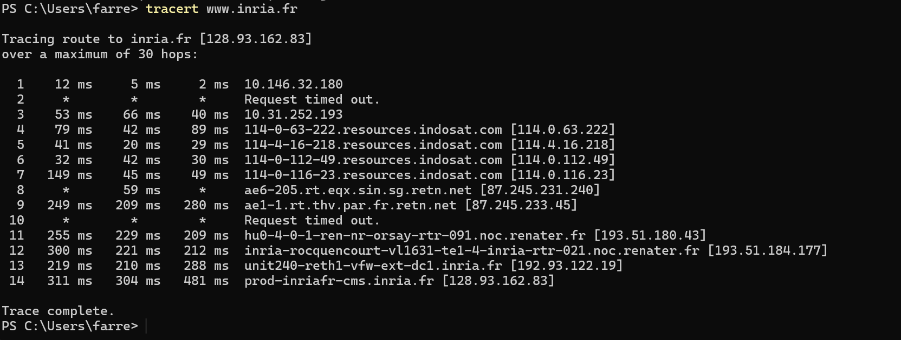
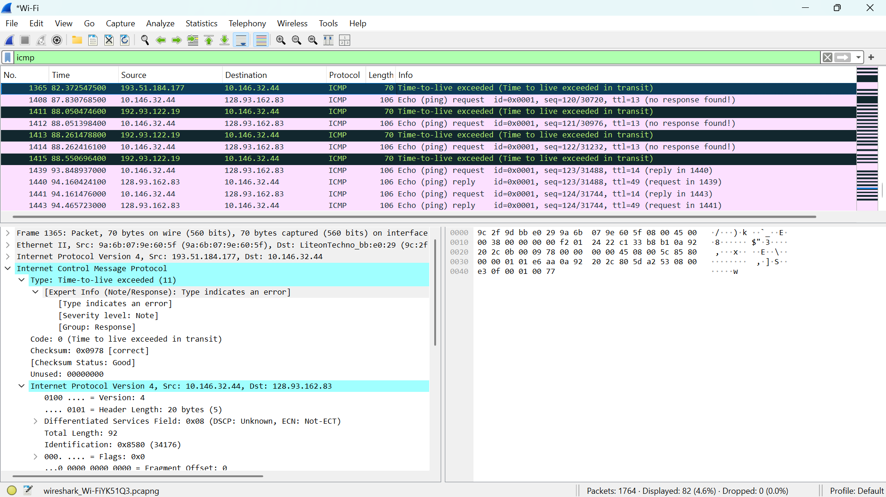

# Laporan Praktikum Jaringan Komputer | Modul 12

**Nama:** Farrellino Ulung Satya Amando  
**NIM:** 103072400005  
**Kelas:** IF 04-01     
---

## 1. Eksekusi ICMP Ping (Command Prompt)
Langkah-langkahnya adalah:
  1. Buka antarmuka Command Prompt pada sistem operasi Windows.
  2. Eksekusi instruksi `ping -n 10 www.ust.hk` untuk mengirimkan 10 paket *probe* jaringan.
  3. Amati hasil statistik pengiriman dan balasan waktu respons dari host tujuan.

> **

**Analisis:**
Utilitas ping terbukti sukses mentransmisikan 10 paket kontrol diagnostik ke server geografis Hong Kong (`www.ust.hk`) tanpa adanya indikasi kegagalan transmisi atau *packet loss* (0%). Kestabilan jaringan tervalidasi dari nilai hitungan *Round-Trip Time* (RTT) yang sangat mumpuni untuk standar latensi koneksi lintas negara, mencetak rata-rata 59-63 ms. Terpantau pula nilai *Time To Live* (TTL) akhir sebesar 42, yang menandakan paket tersebut secara akumulatif telah direlay melewati sekitar 86 lompatan antarmuka router (*hops*) sebelum mendarat di alamat destinasi.

## 2. Analisis Paket ICMP Ping (Wireshark)
Langkah-langkahnya adalah:
  1. Jalankan proses penangkapan lalu lintas paket pada perangkat lunak Wireshark.
  2. Ulangi instruksi transmisi *ping* di terminal, lalu hentikan fungsi perekaman sesaat setelahnya.
  3. Saring riwayat tangkapan jaringan menggunakan kata kunci logis `icmp` dan periksa anatomi paketnya.

> **

**Analisis:**
Pemeriksaan anatomi *frame* jaringan mengidentifikasi skema aliran pertukaran data yang berpasangan secara tertib. Host pengirim menginisiasi kueri peraba dengan spesifikasi ICMP Type 8 Code 0 (*Echo Request*), yang selanjutnya mendapat reaksi langsung dari host destinasi (143.89.209.9) berupa paket pembalas berformat ICMP Type 0 Code 0 (*Echo Reply*). Kedua arah komunikasi ini saling ditautkan menggunakan urutan sinkronisasi *Sequence Number* (seperti 11, 12, 13) serta algoritma pengecekan validitas *Checksum* yang merespons (*Good/Correct*), demi memastikan tidak ada distorsi pada *payload* data ASCII selama fase persinggahan di saluran kabel bawah laut.

## 3. Eksekusi ICMP Traceroute (Command Prompt)
Langkah-langkahnya adalah:
  1. Buka kembali antarmuka utilitas Command Prompt.
  2. Luncurkan perintah pemetaan alur distribusi perutean menggunakan perintah `tracert www.inria.fr`.
  3. Tunggu hingga siklus pelacakan tuntas menembus destinasi sasaran dan evaluasi latensi per *hop*.

> **

**Analisis:**
Pelacakan menggunakan utilitas `tracert` secara transparan mengilustrasikan jejak topologi hierarkis jaringan dari titik peranti praktikan menuju server lembaga Perancis (`www.inria.fr`), melengkapi perjalanan utuhnya di *hop* ke-12. Munculnya indikator *Request timed out* pada deret *hop* 4 dan 5 merepresentasikan perilaku keamanan dinding api (*firewall*) pada router intermedier tersebut yang sengaja diinstruksikan agar menolak bereaksi terhadap kueri kontrol tipe ICMP apa pun. Selebihnya, peningkatan jeda RTT signifikan di rentang 200-400 ms amat wajar ditemui manakala rute bergeser menyentuh transisi infrastruktur *gateway* benua Eropa.

## 4. Analisis Paket Traceroute (Wireshark)
Langkah-langkahnya adalah:
  1. Kosongkan sisa *cache* penangkapan masa lalu dan aktifkan perekaman baru Wireshark.
  2. Eksekusi rutinitas *traceroute*, kemudian matikan operasi mode tangkap (*capture*).
  3. Implementasikan penyaringan khusus tipe `icmp` guna membedah struktur balasan interupsi sistem perutean.

> **

**Analisis:**
Bongkar-susun skema pada level Wireshark membuktikan rekayasa utilitas traceroute yang dengan sengaja mengatur nilai parameter pengurang umur edar (*Time To Live*) dengan sistem penambahan inkremental (bertambah 1 per interaksi). Begitu angka TTL dirampingkan oleh router di tengah lintasan perutean dan menyentuh digit absolut nol, instrumen router akan memicu status alarm melalui pengiriman kembali protokol ICMP Type 11 Code 0 (*Time Exceeded*). Untuk memfasilitasi kebutuhan diagnostik klien, *payload* pada kerangka paket pesan ralat ini memuat salinan ganda header IP orisinal beserta datagram ICMP *Echo Request* inisiator pengirim.

## 5. Asistensi Tugas Besar
Langkah-langkahnya adalah:
  1. Siapkan lembar laporan rekayasa perangkat lunak maupun dokumentasi arsitektur sistem program aplikasi jaringan berjalan.
  2. Buka forum diskusi interaktif tatap muka dengan asisten laboratorium.
  3. Catat anjuran perbaikan teknis (*feedback*) untuk diimplementasikan ke dalam kerangka kode pengerjaan berikutnya.

**Analisis:**
Fokus asistensi ditekankan untuk memastikan struktur fondasi kode program aplikasi klien-server berjalan stabil, presisi, serta selaras dengan landasan metodologi perancangan soket jaringan (*socket programming*). Pemantauan ini krusial guna mengeliminasi peluang kegagalan arsitektur seperti interupsi soket yang menggantung (*lost/zombie connections*), mengevaluasi penerapan algoritma protokol lapisan transpor, serta memastikan eksekusi integrasi *multithreading* terkalibrasi secara optimal dalam merespons aliran permintaan ganda pengguna secara bersamaan.

### 6. Kesimpulan
Berdasarkan praktikum Modul 12, dapat dipelajari hal-hal sebagai berikut.

1. Implementasi rutin aplikasi `ping` dimanfaatkan sebagai mekanisme pengetesan relabilitas ketersediaan sistem jaringan dan utilitas hitung RTT (*Round-Trip Time*) dengan memproyeksikan ICMP *Echo Request* (Type 8) agar mendapat validasi balik *Echo Reply* (Type 0).
2. Metodologi perangkat lunak pelacakan *traceroute* membongkar skema rute fisik *gateway* perantara dengan cara menanamkan injeksi manipulatif angka rentang *Time To Live* (1, 2, 3...) yang sengaja direndahkan pada lapisan Internet Protocol (IP).
3. Paket pesan kontrol ICMP *Time Exceeded* (Type 11 Code 0) bertindak murni sebagai instrumen pengontrol sistem guna menghindari penyumbatan sirkuit jaringan rute memutar yang tak terbatas ketika paket terdeteksi sudah melampaui umur kedaluwarsa perjalanan di antara titik persimpangan perutean.
4. Indikator pemutusan jeda sambungan tak terduga (*timeout*) pada pemeriksaan status *hop* merupakan imbas regulasi absolut router pada infrastruktur penyedia layanan internet (ISP) yang dengan sengaja menutup port reaksi terhadap permintaan balasan tipe ICMP apa pun atas alasan privasi pemetaan keamanan jaringan (*network mapping defense*).
5. Secara praktis, perangkat bedah paket Wireshark menghadirkan korelasi visibilitas tanpa distraksi dalam menata interupsi kesalahan (*error code reporting*) sekaligus membedakan jejak perutean klien secara utuh mulai dari inisiasi paket perantara hingga penyentuhan blok memori server utama.
