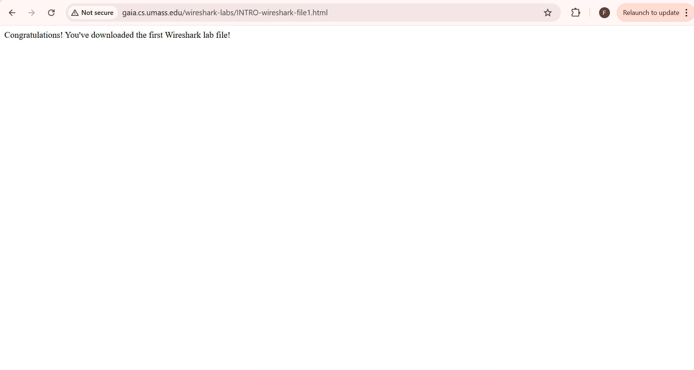
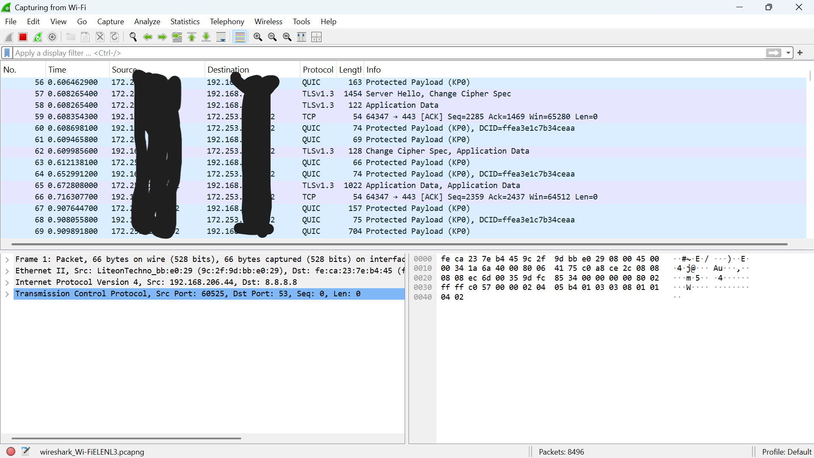
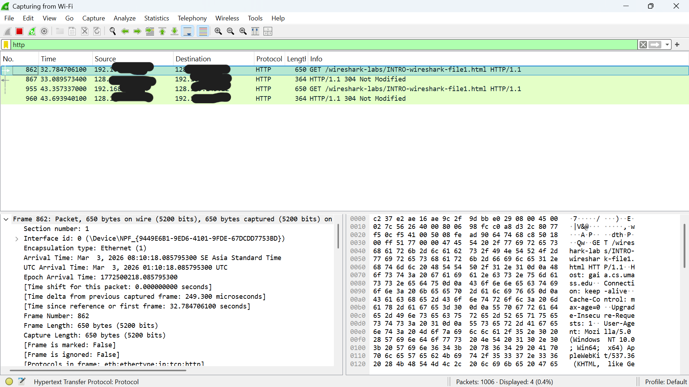

# Laporan Praktikum Jaringan Komputer 
## Modul 2

* **Nama:** Farrellino Ulung Satya Amando
* **NIM:** 103072400005
 
---

### 1. Tujuan Praktikum
Menangkap dan menganalisa paket data dengan menggunakan wireshark.

### 2. Melakukan Capture
1. **Buka Wireshark:** Buka Wireshark, di page yang pertama kali terlihat, pilih capture dengan Wi-Fi (pastikan device terhubung dengan wifi).
  

2. **Buka web browser yang diinginkan:** Akses url berikut di browser: http://gaia.cs.umass.edu/wireshark-labs/INTRO-wireshark-file1.html

3. **Stop Capture:** Klik tombol kotak merah di bagian kiri atas untuk menghetikan capture.

### 3. Analisis Paket yang Telah Dicapture
1. **Tampilan Awal:** Wireshark akan menampilkan seluruh informasi yang telah dicapture.
   
3. **Filter dengan keyword "http":** Dengan memfilter, informasi seperti pesan HTTP GET yang dikirim ke server web dapat ditemukan dan dibaca dengan mudah untuk dianalisa.
   Dengan wireshark, informasi seperti detail protokol dapat dilihat.
   

### 4. Kesimpulan
Wireshark dapat digunakan untuk menangkap paket data yang berjalan di jaringan secara real time dan menampilkannya agar dapat dianalisa. Ini tentunya sangat membantu Ketika melakukan troubleshooting jaringan serta uji keamanan.
