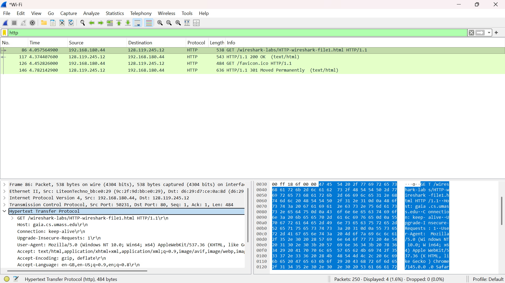
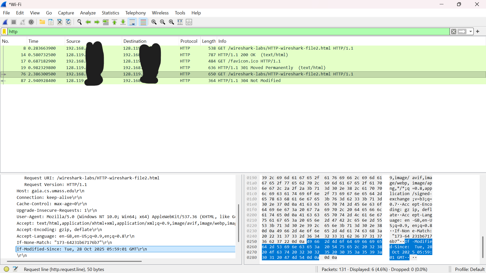
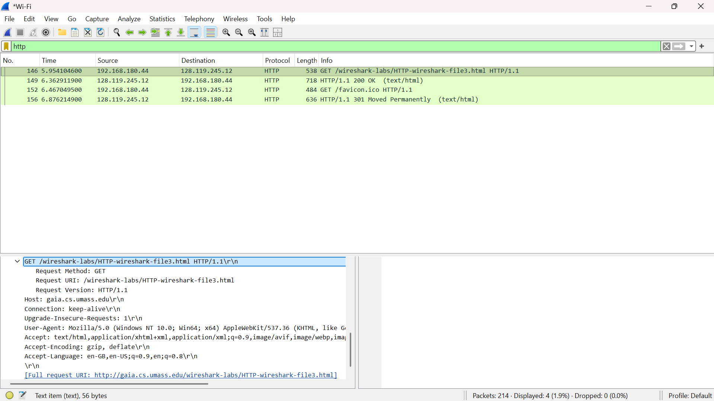
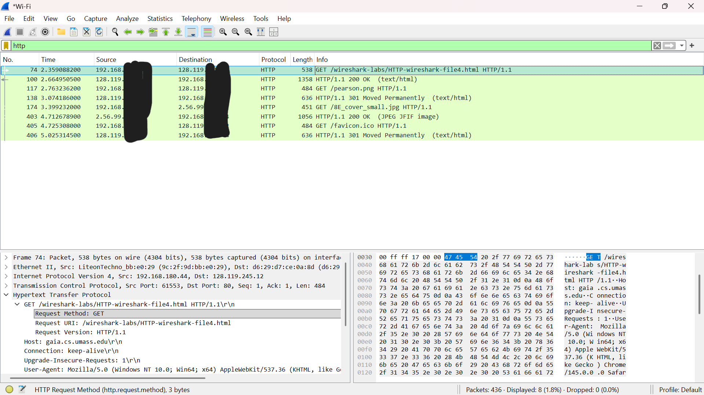
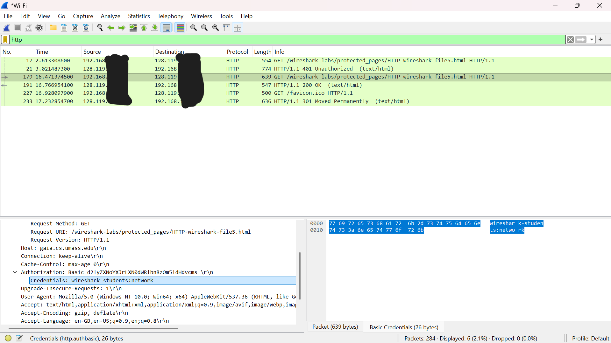

# Laporan Praktikum Jaringan Komputer | Modul 3

**Nama:** Farrellino Ulung Satya Amando
**NIM:** 103072400005
**Kelas:** IF-04-01    
---

## 1. Basic HTTP GET/RESPONSE Interaction
Langkah-langkahnya adalah:
  1. Clear cache browser.
  2. Mulai capture dengan wireshark.
  3. Akses situs : http://gaia.cs.umass.edu/wireshark-labs/HTTP-wireshark-file1.html.
  4. Stop capture dan filter dengan keyword "http".

> **

**Analisis:**
File html berhasil diakses, dapat terlihat dari HTTP GET dari klien dan HTTP OK dari server yang tertangkap di wireshark. Status response 200 OK (text/html) yang menandakan bahwa file html yang hanya berisi teks telah berhasil diakses. Ini merupakan contoh dari sebuah interaksi dasar. 

## 2. HTTP CONDITIONAL GET/RESPONSE Interaction
Langkah-langkahnya adalah:
  1. Clear cache browser.
  2. Mulai capture dengan wireshark.
  3. Akses situs : http://gaia.cs.umass.edu/wireshark-labs/HTTP-wireshark-file2.html.
  4. Refresh halaman untuk mengakses halaman kedua kalinya.
  5. Stop capture dan filter dengan keyword "http".

> **

**Analisis:**
Halaman telah berhasil diakses sebanyak 2 kali. Dapat dilihat di gambar di atas, terdapat header If-Modified-Since yang artinya akses kedua diakses dengan memanfaatkan cache browser. Dideteksi juga respons dari server yaitu 304 Not Modified yang artinya browser mendeteksi bahwa tidak ada perubahan yang terjadi sehingga tidak perlu mengirim/mengunduh isi file lagi yang tentunya akan menghemat bandwidth. 

## 3. Retrieving Long Documents
Langkah-langkahnya adalah:
  1. Clear cache browser.
  2. Mulai capture dengan wireshark.
  3. Akses situs : http://gaia.cs.umass.edu/wireshark-labs/HTTP-wireshark-file3.html.
  4. Stop capture dan filter dengan keyword "http".

> **

**Analisis:**
Halaman yang berisi dokumen yang panjang, sekitar 4500 byte, telah berhasil diakses. Dapat diperhatikan bahwa respons HTTP tidak muat dalam satu paket TCP saja. Keterangan TCP segment of a reassembled PDU juga tidak muncul. Selain itu, paket response HTTP 200 OK hanya berukuran 718 bytes, yang berarti file dikirimkan dalam beberapa paket data yang telah dipecah-pecah menjadi beberapa segmen dan kemudian dikirim   

## 4. HTML Documents dengan Embedded Objects
Langkah-langkahnya adalah:
  1. Clear cache browser.
  2. Mulai capture dengan wireshark.
  3. Akses situs : http://gaia.cs.umass.edu/wireshark-labs/HTTP-wireshark-file4.html.
  4. Stop capture dan filter dengan keyword "http".

> **

**Analisis:**
Halaman yang berisi objek lain, yaitu gambar, berhasil diakses. Dari hasil di atas, dapat terlihat bahwa browser mengunduh file HTML terlebih dahulu, diikuti dengan menemukan URL ke objek berupa gambar tersebut. Ini dibuktikkan dengan terdapat beberapa response HTTP GET yang berupa text/html, sebuah file .png, dan sebuah file .jpg.    

## 5. HTTP Authentication
Langkah-langkahnya adalah:
  1. Clear cache browser.
  2. Mulai capture dengan wireshark.
  3. Akses situs : http://gaia.cs.umass.edu/wireshark-labs/protected_pages/HTTP-wireshark-file5.html.
  4. Masukkan username: wireshark-students dengan password: network
  5. Stop capture dan filter dengan keyword "http".

> **

**Analisis:**
Ketika mengakses halaman, user diminta mengisi username dan password. Ini berarti halaman dilindungi oleh kata sandi. Ketika kata sandi benar, maka halaman akan muncul. Ini dapat terlihat dari response 401 Unauthorized diikuti dengan klien yang melakukan GET dengan menggunakan header Authorization: Basic. Dapat dilihat juga bahwa kredensial diencode dengan Base64 dan bukan dienkripsi sehingga paket memungkinkan untuk ditangkap di traffic jaringan dan username serta password dapat diketahui dengan mudah.  

### 6. Kesimpulan
Berdasarkan praktikum Modul 3, dapat dipelajari hal-hal sebagai berikut.

1. Interaksi dengan komunikasi dasar antara klien, dalam hal ini browser, dengan server terjadi dengan dikirimkannya HTTP GET oleh klien yang dibalas dengan response dari server, salah satu contohnya adalah dengan 200 OK seperti yang telah dilakukan di atas.
2. Mekanisme caching dalam hal Conditional GET sangat mendorong efisiensi jaringan, karena browser tidak perlu mengirim atau mengunduh file lagi, yang artinya akan menghemat bandwidth.
3. Untuk dokumen yang berukuran besar, TCP akan memecah data besar tersebut menjadi beberapa segmen TCP.
4. Objek yang juga harus ditampilkan, prosesnya tidak menjadi satu-kesatuan dengan proses memuat halaman html sehingga dalam mengakses halaman tersebut, dapat terlihat beberapa HTTP GET untuk setiap objek yang harus ditampilkan.
5. Autentikasi dasar HTTP dapat tergolong ke dalam keamanan yang lemah karena kredensial seperti username dan password yang diencode dengan Base64 dapat dibaca dengan mudah dengan cara ditangkap di traffic jaringan dan kemudian dibaca seperti dengan packet sniffer.
