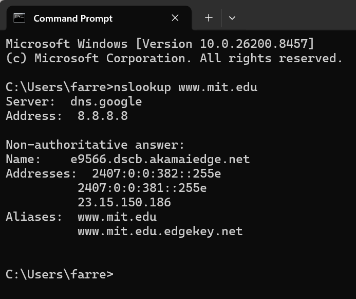
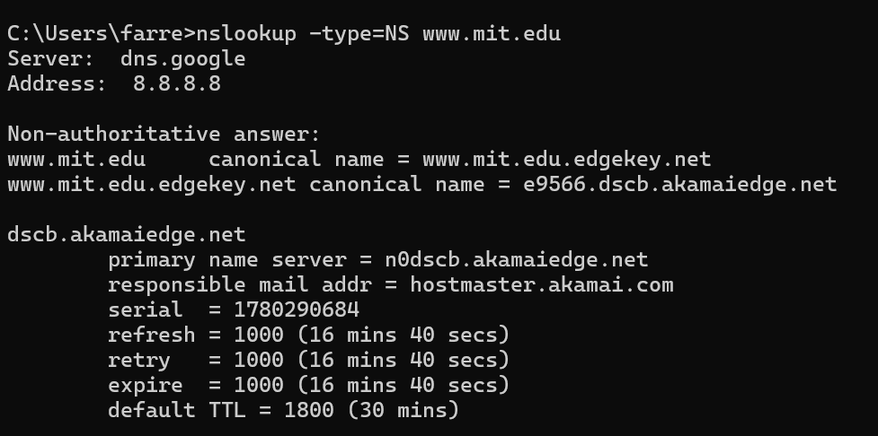
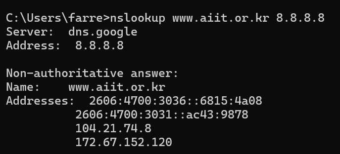
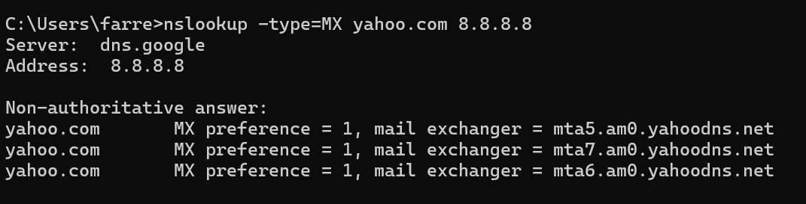
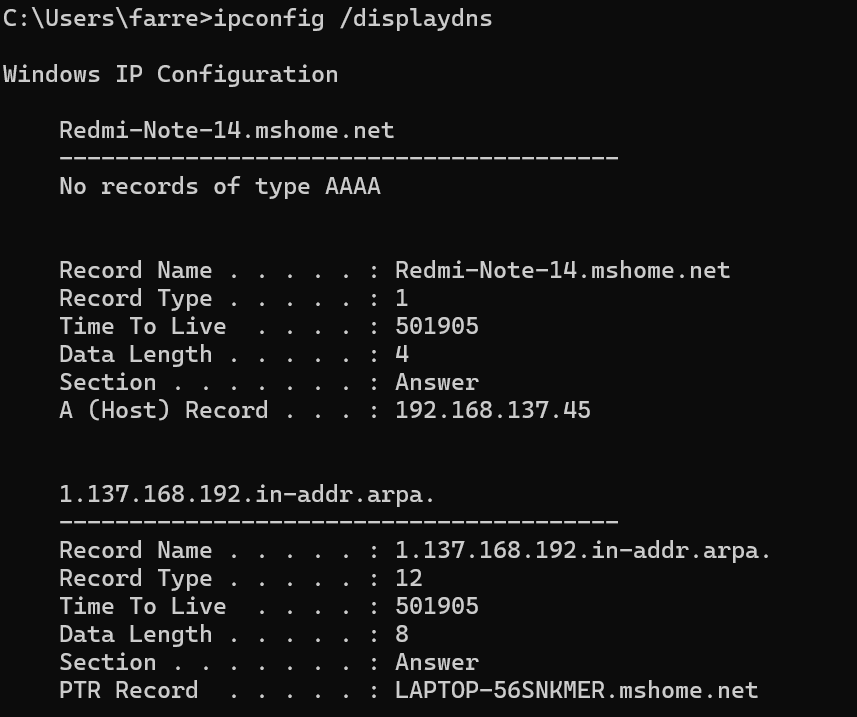
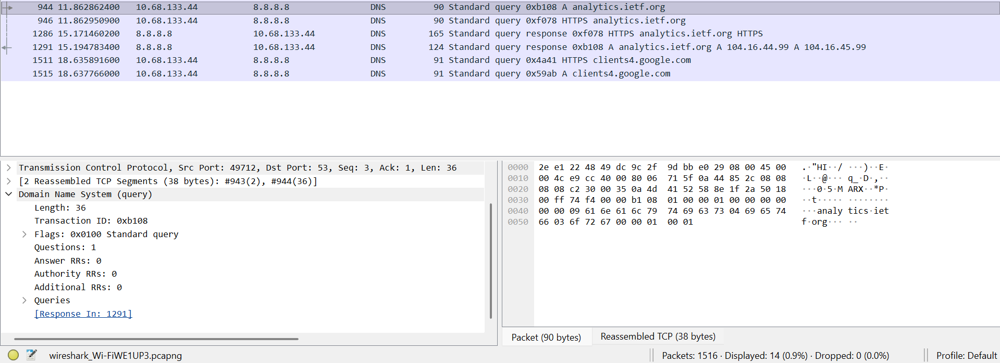
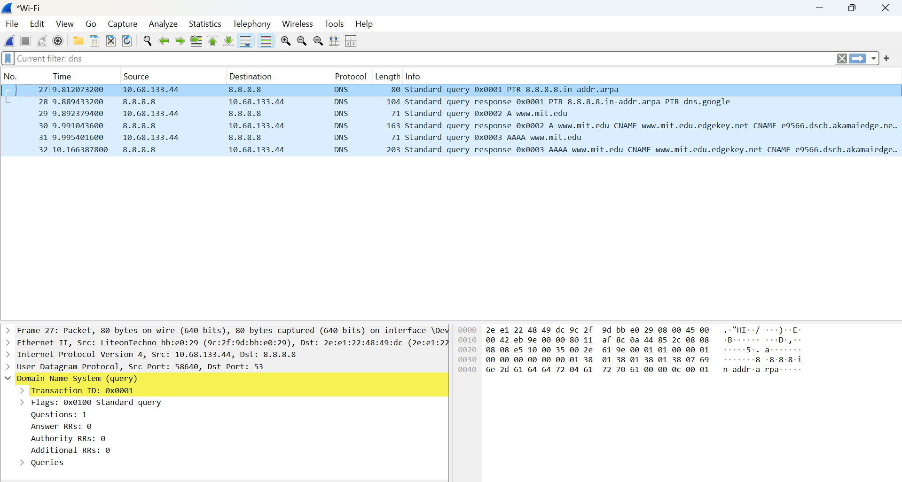
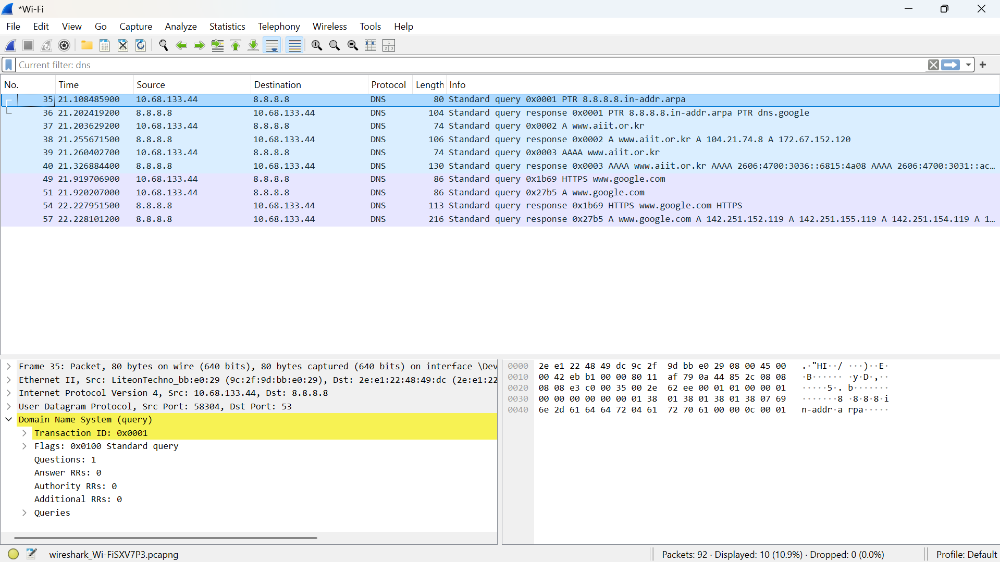

# Laporan Praktikum Jaringan Komputer | Modul 4

**Nama:** Farrellino Ulung Satya Amando  
**NIM:** 103072400005  
**Kelas:** IF 04-01     
---

## 1. Query A Record (Basic Lookup)
Langkah-langkahnya adalah:
  1. Buka command prompt.
  2. Eksekusi perintah `nslookup www.mit.edu`.
  3. Amati hasil alamat IP yang ditampilkan.

> **

**Analisis:**
Dari hasil eksekusi, dapat terlihat bahwa server DNS lokal merespons dengan jawaban yang bersifat non-authoritative. Hal ini menandakan bahwa alamat IP didapatkan dari cache DNS lokal, bukan langsung dari server otoritatif domain tersebut. Selain itu, alamat IP yang dikembalikan merupakan milik server edge CDN Akamai, yang berarti domain tersebut menggunakan layanan CDN.

## 2. Query NS Record (Name Server)
Langkah-langkahnya adalah:
  1. Buka command prompt.
  2. Jalankan perintah `nslookup -type=NS www.mit.edu`.
  3. Amati daftar name server yang muncul.

> **

**Analisis:**
Query DNS dengan mendefinisikan tipe NS berhasil menampilkan daftar server DNS otoritatif untuk domain tersebut. Dari hasil di atas, terlihat beberapa nameserver yang berakhiran akamaiedge.net. Ini dibuktikan bahwa manajemen DNS dari domain www.mit.edu telah didelegasikan kepada infrastruktur CDN Akamai.

## 3. Query ke DNS Server Spesifik
Langkah-langkahnya adalah:
  1. Buka command prompt.
  2. Jalankan perintah `nslookup www.aiit.or.kr 8.8.8.8`.
  3. Amati respons IP yang dikembalikan oleh DNS server Google.

> **

**Analisis:**
Resolusi nama domain diarahkan langsung ke server DNS publik Google (8.8.8.8) tanpa melewati DNS lokal. Hasilnya menunjukkan dukungan dual-stack, karena mengembalikan konfigurasi IPv6 dan IPv4 sekaligus. Terdapat beberapa alamat IP yang dikembalikan untuk satu domain, yang menandakan adanya implementasi load balancing yang didistribusikan melalui jaringan Cloudflare.

## 4. Query MX Record (Mail Server)
Langkah-langkahnya adalah:
  1. Buka command prompt.
  2. Jalankan perintah `nslookup -type=MX yahoo.com 8.8.8.8`.
  3. Amati daftar mail exchanger yang dikembalikan.

> **

**Analisis:**
Permintaan dengan tipe MX berhasil memetakan nama domain ke beberapa mail server yang menangani lalu lintas surel yahoo.com. Dapat dilihat terdapat beberapa peladen seperti mta5, mta6, dan mta7 dengan nilai preferensi 1. Nilai preferensi menunjukkan prioritas, di mana angka yang lebih kecil mendapat prioritas lebih tinggi. Banyaknya rekaman MX ini membuktikan adanya mekanisme redundansi untuk layanan surel.

## 5. Manajemen DNS Cache
Langkah-langkahnya adalah:
  1. Buka command prompt.
  2. Jalankan perintah `ipconfig /displaydns`.
  3. Amati riwayat rekaman cache lokal.

> **

**Analisis:**
Perintah tersebut berhasil menampilkan isi rekaman DNS yang tersimpan dalam cache resolver pada sistem. Setiap entri memuat tipe rekaman (seperti A/PTR record) dan sisa waktu Time To Live (TTL). Mekanisme caching ini sangat mendorong efisiensi jaringan, karena klien tidak perlu lagi mengirim kueri ke luar jaringan untuk domain yang sama selama masa berlaku TTL masih ada, yang artinya akan menghemat bandwidth.

## 6. Analisis Paket DNS dengan Wireshark
Langkah-langkahnya adalah:
  1. Clear cache DNS lokal dengan `ipconfig /flushdns`.
  2. Mulai capture dengan wireshark.
  3. Lakukan akses ke sebuah situs web.
  4. Stop capture dan filter dengan keyword "dns".

> **

**Analisis:**
Berdasarkan hasil tangkapan wireshark, komunikasi DNS terbukti menggunakan protokol transport UDP dengan port tujuan 53. Dapat terlihat paket kueri A (IPv4) dan AAAA (IPv6). Karena menggunakan UDP yang tanpa koneksi, proses pertukaran kueri ini berjalan sangat cepat dan ringan. Klien akan langsung menginisiasi paket TCP SYN untuk melakukan *three-way handshake* setelah alamat IP berhasil diresolusi.

## 7. Analisis Resolusi CNAME Chaining
Langkah-langkahnya adalah:
  1. Mulai capture dengan wireshark.
  2. Eksekusi `nslookup www.mit.edu` pada command prompt.
  3. Stop capture dan amati hierarki responsnya.

> **

**Analisis:**
Dari pemeriksaan paket di wireshark, terlihat adanya proses CNAME Chaining. Resolusi untuk domain www.mit.edu diarahkan melewati beberapa rekaman Canonical Name (CNAME) secara berantai terlebih dahulu sebelum akhirnya berhasil mendapatkan alamat IP asli (A record). Dapat diperhatikan juga bahwa setiap rekaman memiliki nilai TTL yang berbeda-beda.

## 8. Analisis Paket Query ke DNS Publik
Langkah-langkahnya adalah:
  1. Mulai capture dengan wireshark.
  2. Eksekusi `nslookup www.aiit.or.kr 8.8.8.8` pada command prompt.
  3. Stop capture dan filter lalu lintas DNS ke 8.8.8.8.

> **

**Analisis:**
Lalu lintas jaringan memperlihatkan kueri spesifik yang ditujukan ke IP 8.8.8.8. Dari hasil tangkapan tersebut, terlihat rentetan kueri standar lengkap secara berurutan. Namun, kueri ke DNS publik ini umumnya memiliki waktu respons yang sedikit lebih lambat apabila dibandingkan dengan menggunakan cache dari DNS lokal karena adanya tambahan jarak rute (hop) ke server tersebut.

### 9. Kesimpulan
Berdasarkan praktikum Modul 4, dapat dipelajari hal-hal sebagai berikut.

1. Interaksi DNS bertugas menerjemahkan nama domain yang mudah dibaca menjadi alamat IP dengan memanfaatkan server DNS lokal maupun eksternal.
2. Respons non-authoritative menandakan bahwa hasil IP didapatkan dari mekanisme cache lokal berbasis Time To Live (TTL), yang mendorong efisiensi jaringan karena tidak perlu query ulang.
3. Komunikasi pertukaran data DNS umumnya berjalan di atas protokol UDP port 53 untuk memastikan kueri berjalan dengan ringan dan cepat.
4. Beberapa domain mengembalikan lebih dari satu alamat IP dalam satu respons (multiple IP), yang menandakan digunakannya mekanisme load balancing.
5. Domain yang menggunakan layanan Content Delivery Network (CDN) sering kali memicu proses CNAME chaining di mana proses resolusi harus melewati beberapa nama alias secara berantai sebelum mendapatkan alamat IP aslinya.
