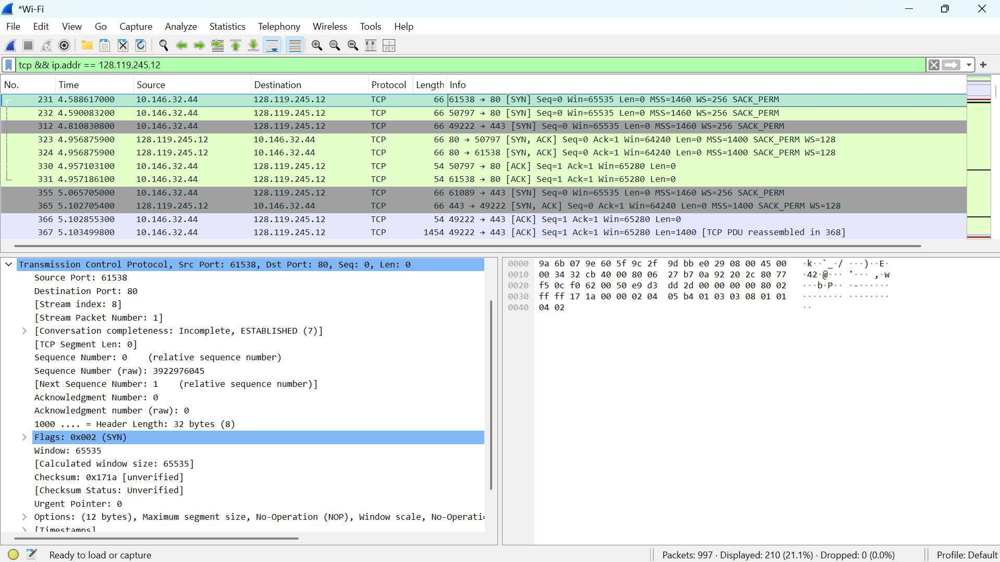
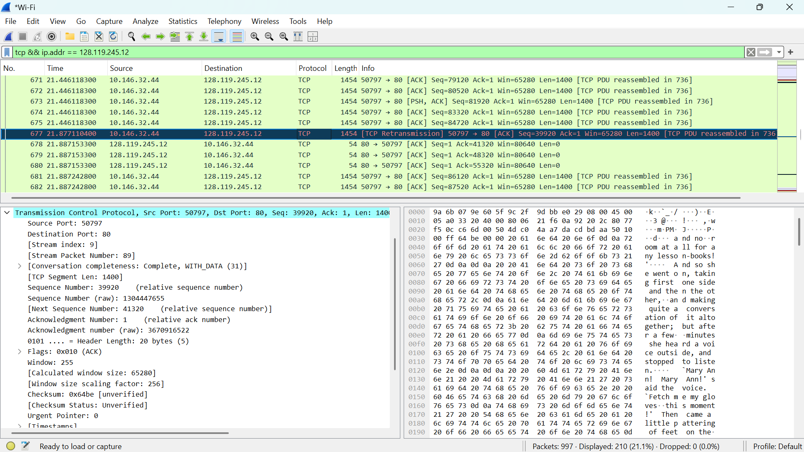
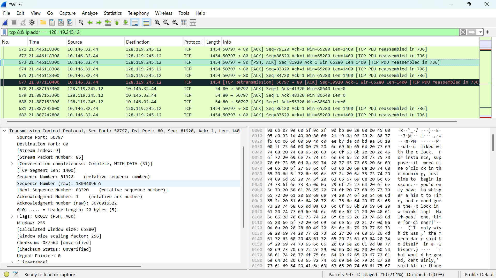
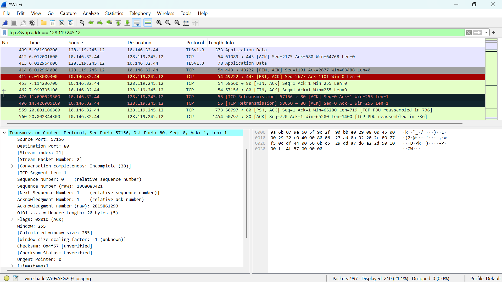

# Laporan Praktikum Jaringan Komputer | Modul 6

**Nama:** Farrellino Ulung Satya Amando  
**NIM:** 103072400005  
**Kelas:** IF 04-01     
---

## 1. Analisis Three-Way Handshake
Langkah-langkahnya adalah:
  1. Mulai capture dengan Wireshark pada antarmuka jaringan yang aktif.
  2. Buka situs yang ditentukan dan unggah file `alice.txt`.
  3. Stop capture dan terapkan filter dengan keyword `tcp && ip.addr == 128.119.245.12`.
  4. Amati urutan paket awal pada saat koneksi terbentuk.

> **

**Analisis:**
Proses pembentukan koneksi TCP dimulai dengan mekanisme *three-way handshake*. Klien memulai inisiasi dengan mengirimkan paket SYN yang memiliki *sequence number* relatif bernilai 0. Server merespons dengan paket SYN-ACK, memberikan *acknowledgment* bernilai 1. Klien kemudian membalas dengan paket ACK, yang menandakan koneksi berstatus *established*. Pada fase ini, dapat terlihat juga terjadinya negosiasi ukuran Maximum Segment Size (MSS) sebesar 1412 bytes serta penetapan nilai *Window Scale* sebesar 256.

## 2. Pengiriman Segmen HTTP POST
Langkah-langkahnya adalah:
  1. Cari dan pilih frame yang mengeksekusi metode HTTP POST pada daftar paket Wireshark.
  2. Lakukan ekspansi pada header Transmission Control Protocol.
  3. Amati field *Sequence Number*, *Flags*, dan besaran *Payload*.

> **

**Analisis:**
Pengiriman data file dimulai melalui instruksi HTTP POST. Frame pengiriman awal ini tercatat memiliki *sequence number* 1 dengan membawa *payload* sebesar 626 bytes, yang utamanya memuat informasi header HTTP. Paket ini menggunakan flag PSH (*Push*) yang menginstruksikan agar layer transpor penerima segera meneruskan data ke layer aplikasi tanpa menunggu *buffer* penuh, bersamaan dengan flag ACK yang mengonfirmasi penerimaan transmisi sebelumnya.

## 3. Analisis Round Trip Time (RTT)
Langkah-langkahnya adalah:
  1. Identifikasi 6 segmen TCP pertama yang membawa data muatan.
  2. Lacak waktu pengiriman segmen dan bandingkan dengan waktu kedatangan paket ACK balasan yang bersesuaian.
  3. Amati nilai kestabilan RTT.

> **

**Analisis:**
Pengamatan pada 6 segmen pertama menunjukkan bahwa nilai Round Trip Time (SampleRTT) sangat stabil di kisaran angka 276 ms. Nilai perkiraan waktu putar balik (*EstimatedRTT*) dihitung secara dinamis menggunakan pemulusan eksponensial dengan formulasi matematis:
$$EstRTT_n = 0.875 \times EstRTT_{n-1} + 0.125 \times SampleRTT_n$$
Kestabilan RTT dengan fluktuasi yang hanya berkisar ±1 ms ini merupakan indikator kuat bahwa kondisi jaringan bekerja dengan sangat optimal dan tidak terjadi antrean pemrosesan yang panjang di sisi *router*.

## 4. Mekanisme Flow Control dan Retransmisi
Langkah-langkahnya adalah:
  1. Periksa parameter *Window Size Value* dan *Window Size Scaling factor* pada rincian paket TCP.
  2. Lakukan pencarian paket yang hilang atau dikirim ulang menggunakan filter `tcp.analysis.retransmission`.
  3. Amati pola pengiriman *Acknowledgment*.

> **

**Analisis:**
Mekanisme pengontrolan aliran (*flow control*) beroperasi tanpa kendala, di mana *actual window size* (hasil kali nilai *window* 255 dengan *scaling factor* 256) mencapai 65.280 bytes. Kondisi *zero-window* tidak pernah terjadi, yang berarti *buffer* penerima selalu memiliki kapasitas untuk menampung data. Pola balasan dari server menggunakan implementasi *Delayed ACK*, di mana satu paket ACK digunakan untuk mengonfirmasi beberapa segmen sekaligus secara kumulatif. Hasil filter retransmisi yang kosong menegaskan tidak adanya insiden kehilangan paket (*packet loss*) selama sesi komunikasi.

## 5. Analisis Throughput dan Congestion Control
Langkah-langkahnya adalah:
  1. Hitung total byte yang ditransfer dibagi dengan total waktu tempuh pengiriman.
  2. Buka menu analitik pada Wireshark melalui *Statistics* > *TCP Stream Graph* > *Time-Sequence-Graph (Stevens)*.
  3. Analisis kurva pertumbuhan ukuran *window* terhadap waktu.

**Analisis:**
Kinerja *throughput* keseluruhan tercatat berada di kisaran 0,525 Mbps (berasal dari 53.353 bytes data yang dikirim dalam waktu 0,813 detik). Secara visual melalui grafik Stevens, fase algoritma *Congestion Control* dapat diidentifikasi. Pada 0,5 detik pertama, grafik menunjukkan kurva yang curam ke atas, merepresentasikan fase *Slow Start* di mana rentang *congestion window* (cwnd) digandakan secara eksponensial setiap satu siklus RTT. Setelahnya, grafik berubah menjadi lebih landai dan linear, yang menandakan transisi menuju fase *Congestion Avoidance* dengan peningkatan kecepatan secara konstan (penambahan 1 MSS per RTT) untuk mencegah terjadinya kongesti jaringan.

### 6. Kesimpulan
Berdasarkan praktikum Modul 6 mengenai protokol TCP, dapat dipelajari hal-hal sebagai berikut:

1. Proses *three-way handshake* merupakan prosedur esensial dalam TCP untuk menegosiasikan parameter awal seperti Maximum Segment Size (MSS) dan *window scaling* sebelum pertukaran data diizinkan.
2. Protokol memastikan pengiriman data yang andal menggunakan kombinasi *Sequence Number* untuk mengurutkan data dan *Acknowledgment* (ACK) untuk mengonfirmasi penerimaan secara kumulatif.
3. Fitur *flow control* pada TCP terbukti mencegah kelebihan muatan pada *buffer* penerima dengan secara dinamis menginformasikan sisa kapasitas penyimpanan melalui parameter *Window Size*.
4. Algoritma *congestion control* secara proaktif mencegah kemacetan di rute jaringan melalui mekanisme *Slow Start* (pertumbuhan kapasitas eksponensial di awal) dan *Congestion Avoidance* (pertumbuhan linear yang lebih berhati-hati).
5. Ketiadaan retransmisi paket dan nilai *EstimatedRTT* yang konstan menunjukkan reliabilitas koneksi yang stabil antara klien dan server tanpa adanya fragmentasi atau *packet loss*.
