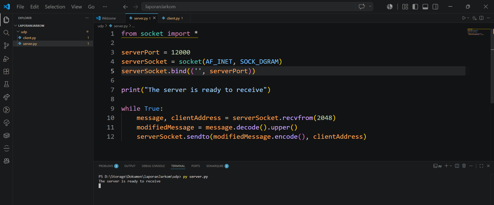
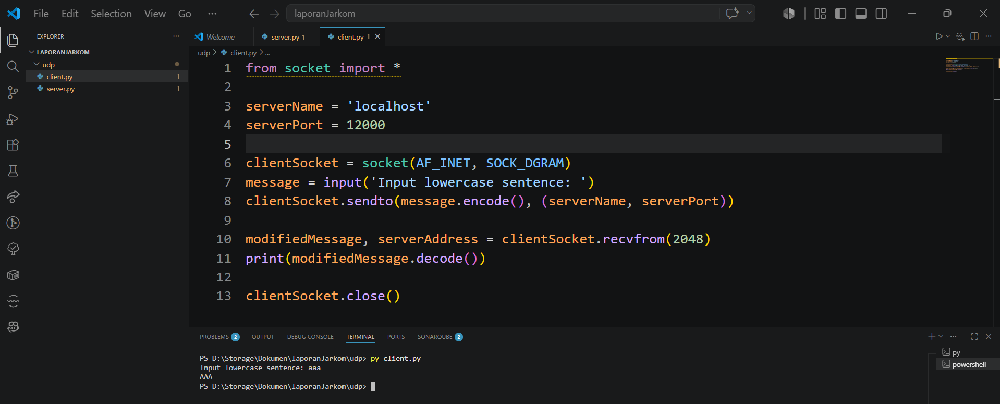
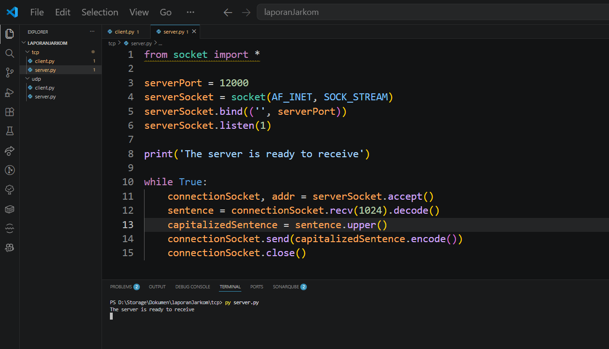
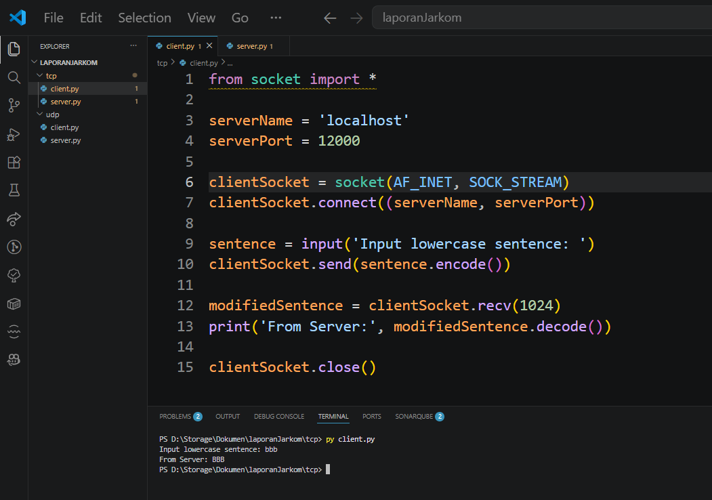

# Laporan Praktikum Jaringan Komputer | Modul 7

**Nama:** Farrellino Ulung Satya Amando  
**NIM:** 103072400005  
**Kelas:** IF 04-01     
---

## 1. Implementasi UDP Server
Langkah-langkahnya adalah:
  1. Buat skrip `UDPServer.py` menggunakan pustaka `socket`.
  2. Deklarasikan jenis socket jaringan sebagai `SOCK_DGRAM`.
  3. Jalankan skrip server pada terminal pertama agar *standby* menerima pesan.

> **

**Analisis:**
Server beroperasi menggunakan UDP socket yang mengikat (*bind*) pada port 12000. Server berjalan secara terus-menerus dalam *loop* tak terbatas (*while True*) menunggu pesan masuk melalui metode `recvfrom()`. Hal ini membuktikan sifat *connectionless* dari UDP; server tidak perlu melakukan *handshake* atau menjaga status koneksi spesifik dengan klien. Satu socket tunggal ini mampu menerima datagram dari berbagai sumber yang berbeda secara langsung.

## 2. Implementasi UDP Client
Langkah-langkahnya adalah:
  1. Buat skrip `UDPClient.py` tanpa perlu mengikat *port* lokal.
  2. Eksekusi klien di terminal terpisah.
  3. Input sebuah pesan dengan format huruf kecil (*lowercase*), misalnya "hello world".

> **

**Analisis:**
Klien berhasil mengirimkan datagram berisi pesan "hello world" langsung menuju alamat `localhost` dan port `12000` menggunakan metode `sendto()`. Tidak ada proses pembentukan koneksi awal seperti pemanggilan metode `connect()`. Setelah memproses data, server mengembalikan string yang telah dimodifikasi menjadi *uppercase* ("HELLO WORLD"), yang kemudian ditangkap klien dengan metode `recvfrom()`. Kecepatan pengiriman sangat tinggi berkat tidak adanya *overhead* pengaturan koneksi.

## 3. Implementasi TCP Server
Langkah-langkahnya adalah:
  1. Buat skrip `TCPServer.py` dengan menetapkan socket bertipe `SOCK_STREAM`.
  2. Panggil metode `listen(1)` untuk menyiapkan antrean koneksi masuk.
  3. Jalankan server pada terminal untuk mulai mendengarkan (*listening*).

> **

**Analisis:**
Berbeda dengan arsitektur UDP, TCP server menggunakan arsitektur *connection-oriented*. Setelah melakukan `bind`, server mengeksekusi fungsi `listen(1)` untuk mengantre maksimal 1 permintaan koneksi. Ketika klien mencoba terhubung, server memanggil fungsi `accept()`. Fungsi ini secara otomatis mendedikasikan sebuah *socket* baru (`connectionSocket`) yang khusus digunakan untuk menangani aliran data (*stream*) dua arah dengan klien tersebut, sementara *server socket* utama tetap terbuka untuk mendengarkan klien lain.

## 4. Implementasi TCP Client
Langkah-langkahnya adalah:
  1. Buat skrip `TCPClient.py`.
  2. Jalankan klien dan inisiasi pembentukan sesi komunikasi ke server.
  3. Ketikkan kalimat "networking lab" dan amati balasan dari server.

> **

**Analisis:**
Klien memulai interaksi secara eksplisit dengan memanggil metode `connect()`, yang di latar belakang akan memicu proses pertukaran *three-way handshake* (SYN, SYN-ACK, ACK) dengan server. Setelah koneksi berstatus *established*, klien tidak perlu lagi menyertakan alamat tujuan pada setiap paket data; pengiriman murni menggunakan aliran data berkelanjutan dengan metode `send()`. Pesan "networking lab" dijamin sampai di sisi server, diproses, dan diterima kembali sebagai "NETWORKING LAB" melalui metode `recv()`, menunjukkan tingkat reliabilitas (keandalan) yang tinggi.

### 5. Kesimpulan
Berdasarkan praktikum Modul 7 mengenai Socket Programming, dapat dipelajari hal-hal sebagai berikut.

1. Implementasi UDP Socket (`SOCK_DGRAM`) bersifat nirkoneksi, di mana klien dan server saling bertukar pesan menggunakan metode `sendto()` dan `recvfrom()` tanpa adanya jaminan garansi pengiriman (*reliable delivery*).
2. Transmisi menggunakan UDP memiliki keunggulan dari segi performa dan minimnya *overhead*, menjadikannya protokol yang paling tepat untuk layanan dengan prioritas latensi rendah (*real-time*).
3. Implementasi TCP Socket (`SOCK_STREAM`) membutuhkan prosedur yang lebih panjang, diawali dengan metode `connect()` di sisi klien serta `listen()` dan `accept()` di sisi server.
4. Server TCP memelihara dua lapisan socket yang berbeda: satu *welcoming socket* untuk memantau permintaan klien baru, dan satu *connection socket* per klien untuk memastikan pengiriman byte terurut dan reliabel.
5. Pada kondisi tanpa implementasi *threading*, satu soket UDP server mampu melayani banyak klien secara simultan, sedangkan soket TCP akan melayani klien secara berurutan (*sequential*), di mana klien baru harus menunggu di dalam antrean hingga soket TCP selesai memproses klien saat ini.
