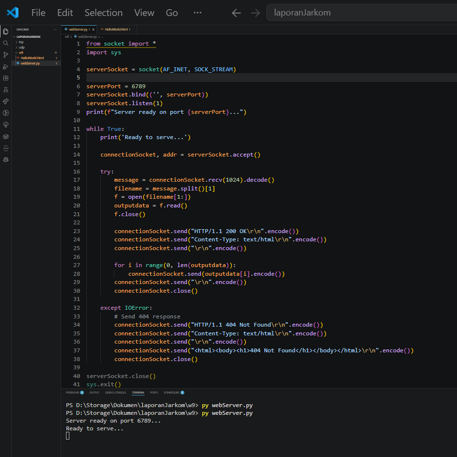
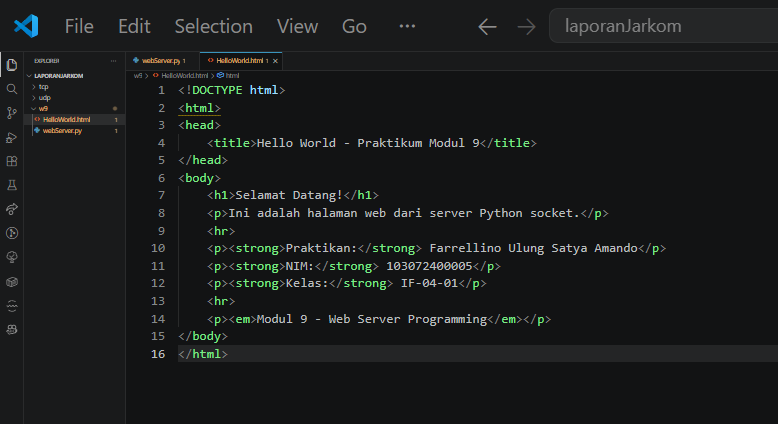
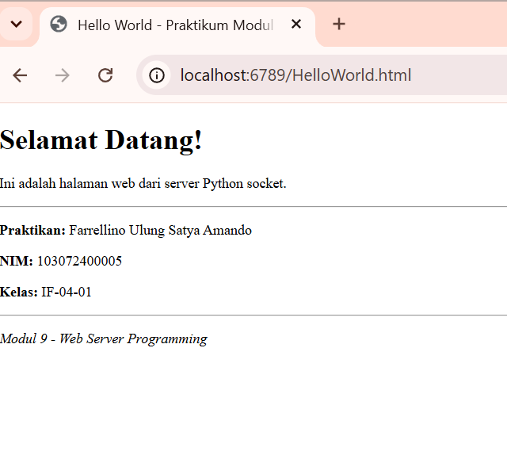

# Laporan Praktikum Jaringan Komputer | Modul 9

**Nama:** Farrellino Ulung Satya Amando  
**NIM:** 103072400005  
**Kelas:** IF 04-01     

## 1. Konfigurasi dan Parsing Request pada Web Server
Langkah-langkahnya adalah:
  1. Siapkan struktur direktori yang memuat skrip Python server dan file HTML target.
  2. Susun kode web server menggunakan pustaka *socket* bawaan Python.
  3. Jalankan skrip `WebServer.py` melalui antarmuka terminal/IDE.

> **

**Analisis:**
Implementasi web server dibangun menggunakan soket TCP (`AF_INET`, `SOCK_STREAM`) yang diikat (*bind*) ke port lokal 6789. Server memanfaatkan metode `listen(1)` untuk membuka antrean koneksi tunggal dan sebuah *loop* tak terbatas (*while True*) yang dikonfigurasi menanti kedatangan sesi melalui `accept()`. Ketika *request* HTTP GET dari klien tiba, metode `recv(1024)` menangkap data tersebut, melakukan *decoding* ke dalam bentuk *string*, lalu mengekstrak nama file yang direkues menggunakan pemisahan indeks parameter (*split*) guna memetakan URI ke direktori file sistem lokal.

## 2. Pengujian HTTP Response 200 OK
Langkah-langkahnya adalah:
  1. Pastikan server Python sedang beroperasi (*listening*).
  2. Buka penjelajah web (browser).
  3. Akses *Uniform Resource Locator* (URL) `http://localhost:6789/HelloWorld.html`.

> **
> **

**Analisis:**
Situs web statis berhasil diakses dan dirender sempurna oleh penjelajah web. Kesuksesan interaksi ini dibuktikan dengan perakitan manual balasan protokol HTTP pada kode server yang mengirimkan baris status `HTTP/1.1 200 OK\r\n` diikuti dengan spesifikasi penanda MIME `Content-Type: text/html\r\n\r\n`. Penggunaan *carriage return* dan *line feed* (`\r\n`) yang diakhiri dengan baris kosong merupakan sintaks absolut yang memisahkan area *header* dengan area *body* pesan HTTP yang mengangkut kode mentah (HTML) ke sisi klien untuk kemudian diproses ke dalam antarmuka grafis.

## 3. Penanganan Eksepsi (HTTP Response 404 Not Found)
Langkah-langkahnya adalah:
  1. Biarkan web server terus beroperasi.
  2. Buka *command prompt* atau PowerShell.
  3. Akses file yang tidak eksis di direktori menggunakan perintah `curl.exe -v http://localhost:6789/NotFound.html`.

> **

**Analisis:**
Server mendemonstrasikan keandalannya dalam menangani jalur yang tidak valid dengan memicu blok eksepsi `try-except`. Saat fungsi `open()` di Python gagal menemukan lokasi berkas yang diminta, sebuah `IOError` dilemparkan. Blok penanganan *error* kemudian mengambil alih transmisi soket untuk mengembalikan baris kode kesalahan `HTTP/1.1 404 Not Found` bersamaan dengan respons *body* HTML sederhana. Eksekusi ini mencegah aplikasi *server* mengalami penutupan (*crash*) yang tak terduga dan tetap memberikan indikator status yang sesuai standar RFC kepada klien penanya.

## 4. Mekanisme Penutupan Koneksi Soket
Langkah-langkahnya adalah:
  1. Analisis respons data lengkap melalui eksekusi *verbose command* (seperti curl).
  2. Tinjau kembali instruksi alur penutupan pada baris kode program utama.

**Analisis:**
Protokol HTTP/1.1 umumnya menggunakan pengaturan *keep-alive* untuk menahan koneksi tetap terbuka, namun skrip server sederhana ini dibangun dengan pendekatan koneksi yang langsung diputus secara eksplisit. Setelah seluruh paket *outputdata* selesai ditransmisikan menggunakan blok perulangan *for*, fungsi `connectionSocket.close()` dipanggil untuk segera menutup soket terdedikasi klien. Cara ini memastikan efisiensi pelepasan sumber daya (memori/port lokal) untuk mengizinkan instruksi `accept()` pada iterasi siklus *loop* utama (*while True*) melayani sisa klien berikutnya secara berkesinambungan dan stabil.

### 5. Kesimpulan
Berdasarkan praktikum Modul 9 mengenai Web Server Programming, dapat dipelajari hal-hal sebagai berikut:

1. Modul perakitan arsitektur aplikasi *web server* mensyaratkan pemahaman yang utuh terkait manipulasi *string* di layer aplikasi guna mengonversi baris *request* TCP mentah menjadi struktur nama direktori file yang dapat dikenali sistem operasi (*parsing file path*).
2. Kode status protokol `200 OK` (bersama *payload* isi berkas aktual) digunakan sebagai standar persetujuan saat proses permintaan *file* terverifikasi valid, sedangkan `404 Not Found` diterapkan untuk mengelola permintaan yang cacat/tidak ada.
3. Transmisi antara batas header (*HTTP header*) dan kode muatan data (*body payload*) secara baku dibedakan oleh elemen *blank line* (baris kosong) yang diinisiasikan dengan rangkaian deret karakter `\r\n`.
4. Mekanisme isolasi blok eksepsi (*exception handling*) sangat esensial agar server tidak berhenti memproses permintaan (*listening process*) ketika timbul galat di pertengahan waktu-jalan (*runtime error*) karena ekspektasi input klien yang melenceng.
5. Pada pola aplikasi sekuensial tak sinkron ini, operasi penutupan jalur koneksi `close()` bersifat mutlak untuk mencegah penumpukan soket menggantung (*zombie connections*) di dalam pengalamatan port yang digunakan server.
